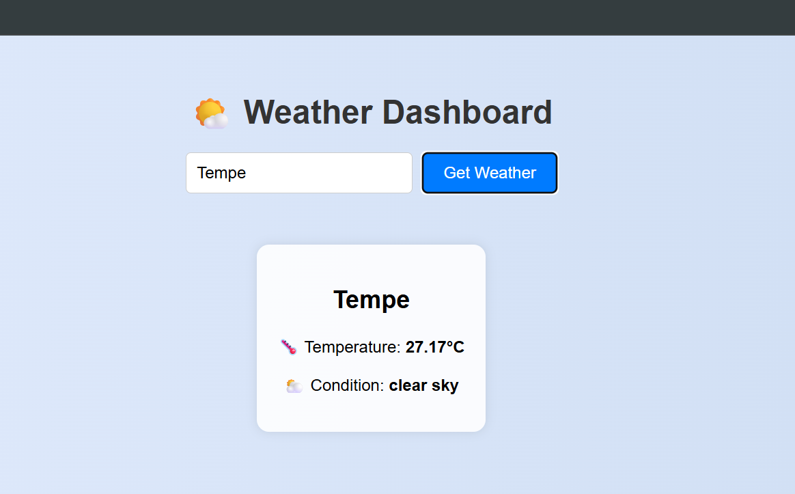

# ⛅ Weather Dashboard

A simple and responsive weather dashboard built with React. It fetches real-time weather data from the [OpenWeatherMap API](https://openweathermap.org/api) and displays temperature and conditions based on user input (city name).

---

## ✨ Features

- 🔎 Search weather by city
- 🌡️ Display real-time temperature and weather condition
- ⚙️ Uses OpenWeatherMap API for accurate data
- 🧠 Built using React Hooks (`useState`, `useEffect`)
- 💡 Simple, responsive UI with no external styling libraries

---

## 🛠️ Tech Stack

| Technology        | Description                    |
|------------------|--------------------------------|
| React            | UI rendering and state mgmt    |
| HTML/CSS         | Markup and styles              |
| OpenWeatherMap   | Real-time weather API          |

---

## 🖼️ Screenshots

### 🌦️ City Weather Lookup




---

## 🧑‍💻 Installation

```bash
git clone https://github.com/yourusername/weather-dashboard.git
cd weather-dashboard
npm install
````

---

## 🚀 Usage

1. Go to [https://openweathermap.org/api](https://openweathermap.org/api) and sign up for a free API key.

2. Open `App.js` and replace:

   ```js
   const API_KEY = 'YOUR_OPENWEATHERMAP_API_KEY';
   ```

3. Start the app:

```bash
npm start
```

Then go to:
📍 `http://localhost:3000`

---

## 🔌 API Used

This project uses the [OpenWeatherMap API](https://openweathermap.org/current):

* **Endpoint**: `https://api.openweathermap.org/data/2.5/weather`
* **Required parameters**:

  * `q` — city name
  * `appid` — your API key
  * `units=metric` for Celsius

**Example**:

```bash
https://api.openweathermap.org/data/2.5/weather?q=London&appid=YOUR_KEY&units=metric
```

---

## 📁 Project Structure

```
weather-dashboard/
├── public/
│   └── index.html
├── src/
│   ├── App.js           # Main app component
│   └── index.js         # React entry point
├── screenshots/
│   └── search.png       # Screenshot image
├── .gitignore
├── package.json
└── README.md
```

---

## 📝 License

This project is open-source and licensed under the [MIT License](https://opensource.org/licenses/MIT).

---

## 🙌 Acknowledgements

* [OpenWeatherMap API](https://openweathermap.org/api)
* [React Documentation](https://reactjs.org/)
* Inspired by basic weather apps built using fetch and state
